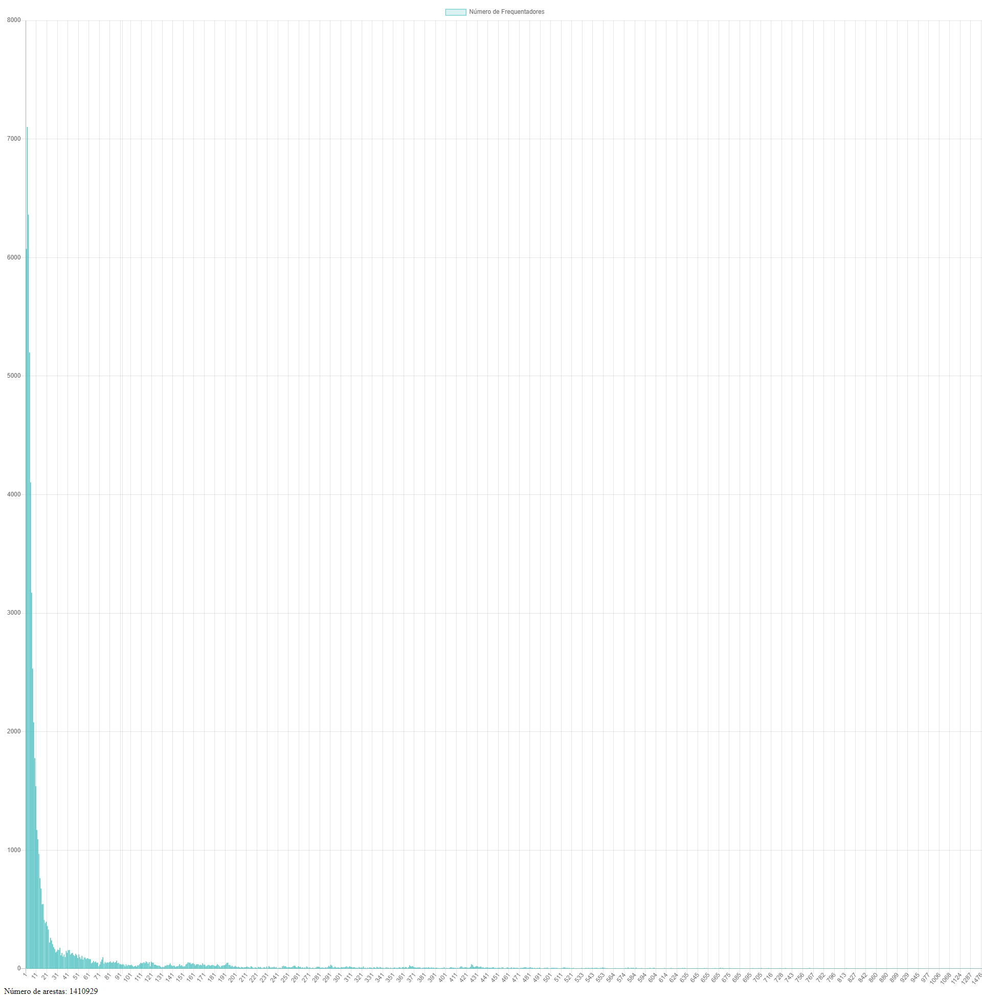

# Objetivo

O objetivo dessa tarefa é criar um grafo utilizando a base de pesquisa do Metrô e obter a distribuição dos graus dos nós desse grafo, ou seja, descobrir quantas pessoas encontram-se com tantas outras.

# Representação do grafo

Para o desenvolvimento desta parte da tarefa, foi criada uma classe para representar o grafo (Graph.cs) e uma classe para representar o nós (Node.cs). A classe Graph possui uma lista de objetos do tipo Node, e cada Node possui um inteiro representado seu ID e uma lista de objetos do tipo Node que representa seus vizinhos.

### Graph.cs

```C#
public IList<Node> Nodes { get; set; }
```

### Node.cs

```C#
public int Id { get; set; }
public IList<Node> Neighboors { get; set; }
```

# Cenário utilizado

O cenário escolhido para essa tarefa foi aquele em que tudo está funcionando normalmente. O grafo foi construído utilizando o arquivo _Data/cenario1.txt_.

Embora a representação utilizada no arquivo de texto já contenha o número de arestas do grafo, foi implementada a propriedade _EdgesCount_ na classe **Graph** que calcula o número de arestas em tempo de execução com base nos nós do grafo. O método _Get()_ dessa propriedade soma o número total de vizinhos de cada nó e divide por 2, já que o grafo não é direcionado e assim o número total de nós sempre será par.

```C#
public int EdgesCount
{
    get
    {
        return Nodes.SelectMany(n => n.Neighboors).Count() / 2;
    }
}
```

# Processamento

Para processar o arquivo de texto e convertê-lo para um objeto _Graph_ foi necessário criar um dicionário interno para guardar os endereços dos nós. Sem esse dicionário, o processamento dos arquivos estava levando um tempo absurdamente alto.

```C#
private IDictionary<int, Node> _nodesDictionary;
```

Esse dicionário guarda o ID do nó e seu respectivo objeto _Node_. Ele é utilizado no método responsável por adicionar um novo vizinho, fazendo a consulta de um nó já existente através de sua identificação.

A complexidade assintótica do método de obter um valor do dicionário é O(1), o que fez com que a leitura do arquivo de texto fosse possível de ser concluída em apenas alguns segundos.

# Resultados

O número total de arestas do grafo do cenário escolhido é 1.410.929.

O histograma dos graus dos nós pode ser visualizado abaixo.



As barras representam o número de frequentadores. Ou seja, há 1 lugar que é frequentado por 6073 pessoas diferentes, há 2 lugares que são frequentados por 7102 pessoas diferentes, etc.
