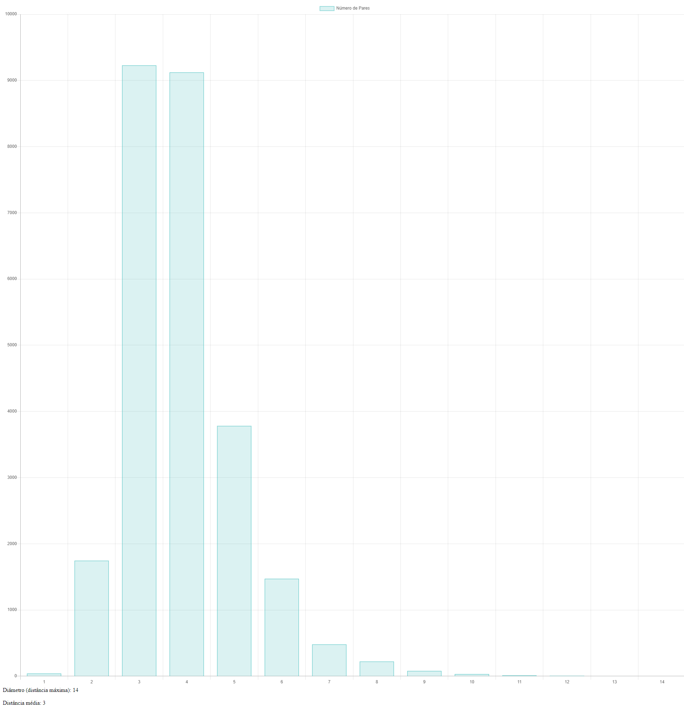
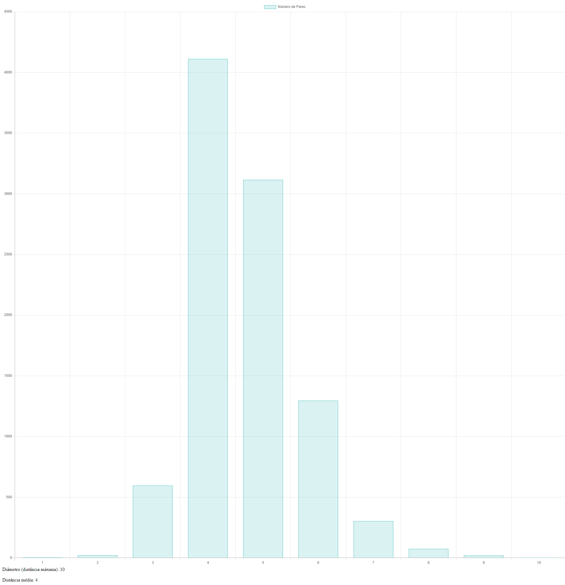
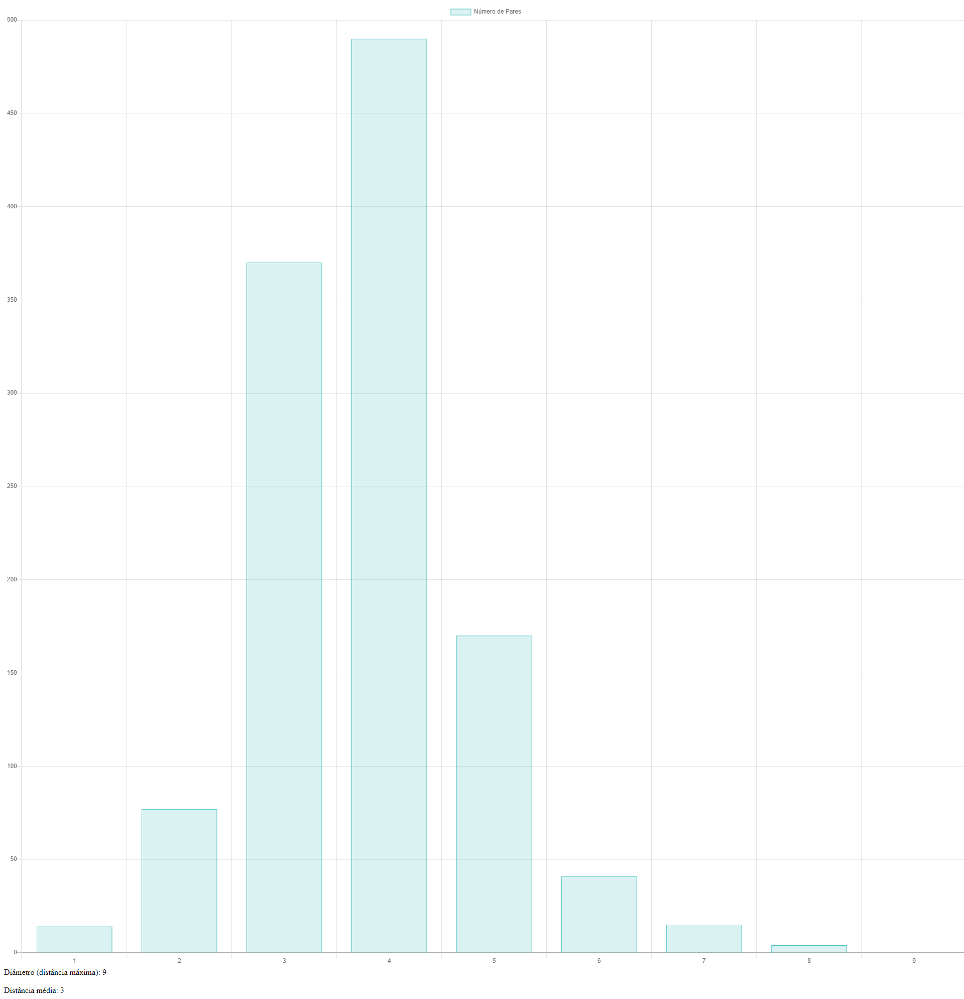

# Cenário utilizado

Para esta tarefa, foram utilizados os três cenários disponíveis. O primeiro é aquele no qual tudo está funcionando normalmente. No segundo, os locais de aglomeração estão fechados. Já no terceiro apenas os serviços essenciais estão abertos.

# Como foi calculado

Para obter as distâncias foi utilizada a busca em largura. Para isso, foi utilizada uma *fila* de nós não visitados. Um laço vai desenfileirando os nós dessa fila e adicionando seus vizinhos ainda não visitados a ela, marcando a distância em uma lista de distâncias.

O retorno desse método é um dicionário, no qual a chave é distância e o valor é o número de pares.

```C#
public Dictionary<int, int> GetDistances()
{
    // lista que armazenará as distâncias encontradas
    var distances = new List<int>();
    var nodesToVisit = new Queue<Node>();
    // pega o primeiro nó do grafo para começar a visita
    var firstNode = Nodes.First();
    nodesToVisit.Enqueue(firstNode);
    var nodeDistances = new Dictionary<int, int>
        {
            { firstNode.Id, 0 }
        };
    while (nodesToVisit.Any())
    {
        var currentNode = nodesToVisit.Dequeue();
        // percorre todos os vizinhos que ainda não foram visitados
        foreach (var neighboor in currentNode.Neighboors.Where(n => !nodeDistances.ContainsKey(n.Id)))
        {
            nodesToVisit.Enqueue(neighboor);
            // a distância até o vizinho é a distância até o nó atual + 1
            var distance = nodeDistances[currentNode.Id] + 1;
            nodeDistances.Add(neighboor.Id, distance);
            distances.Add(distance);
        }
    }
    var distancesDictionary = new Dictionary<int, int>();
    // monta o dicionário que será retornado como resultado do método
    foreach (var distance in distances.Distinct())
    {
        distancesDictionary.Add(distance, distances.Count(d => d == distance) / 2);
    }
    return distancesDictionary;
}
```

O tempo de processamento foi bem rápido por conta das otimizações utilizadas nas tarefas anteriores, tudo foi calculado em questão de segundos.

A busca em largura leva um tempo O(n), em que *n* é o número de nós, uma vez que todos os nós precisam ser visitados ao menos uma vez (e, assim, precisam ser enfileirados ao menos uma vez). Já o cálculo de distância levará um tempo O(e), em que *e* é o número de arestas, uma vez que cada aresta precisa ser calculada.

No total, a complexidade total do tempo é O(n + e).

# Resultados

No primeiro cenário, o diâmetro do grafo ficou em 14, ou seja, essa foi a distância máxima entre dois frequentadores diferentes. Já a distância média foi de 3.

No segundo cenário, a distância média aumentou para 4 e o diâmetro diminuiu para 10. Isso mostrou indícios de que uma quarentena mais rigorosa diminuísse o risco de contaminação por contato.

No entanto, no terceiro cenário a distância média voltou a ser 3. Isso talvez por conta do número de pessoas entrevistadas na pesquisa. O diâmetro ficou em 9.

# Histogramas

## Cenário 1



## Cenário 2



## Cenário 3



