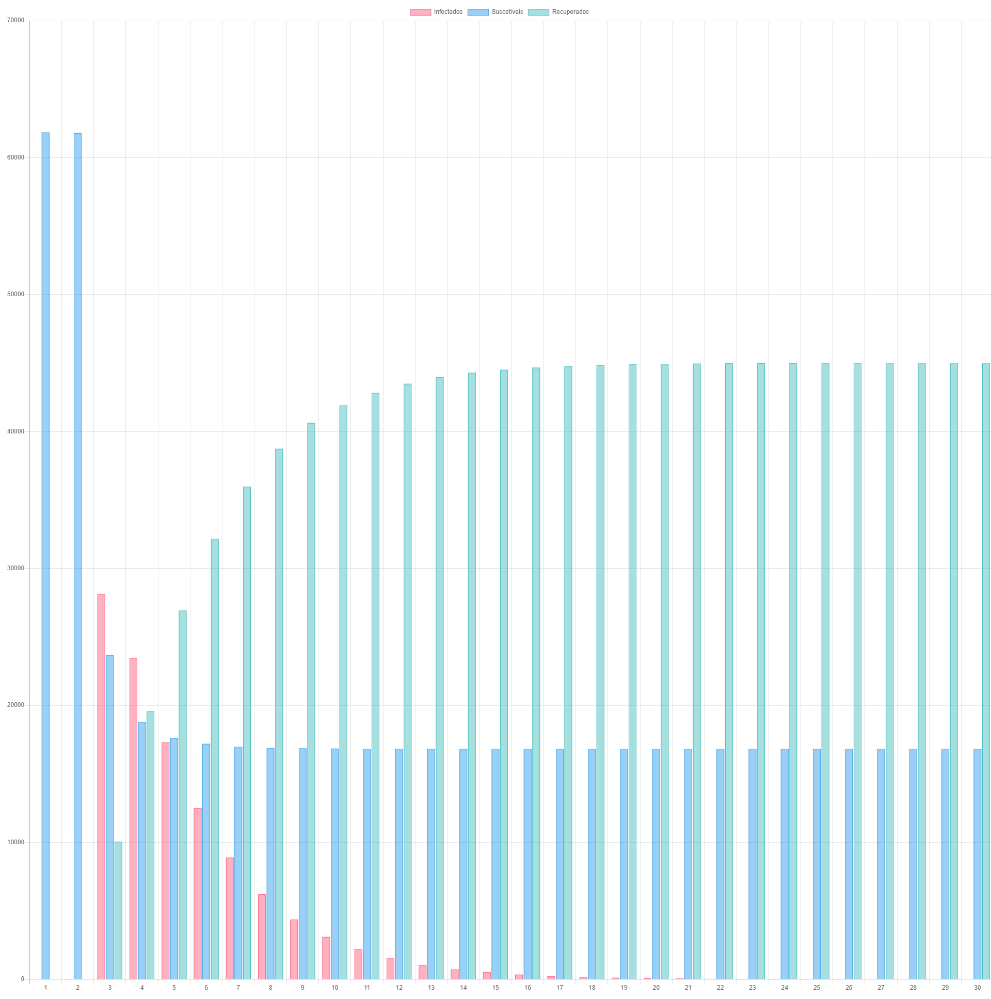
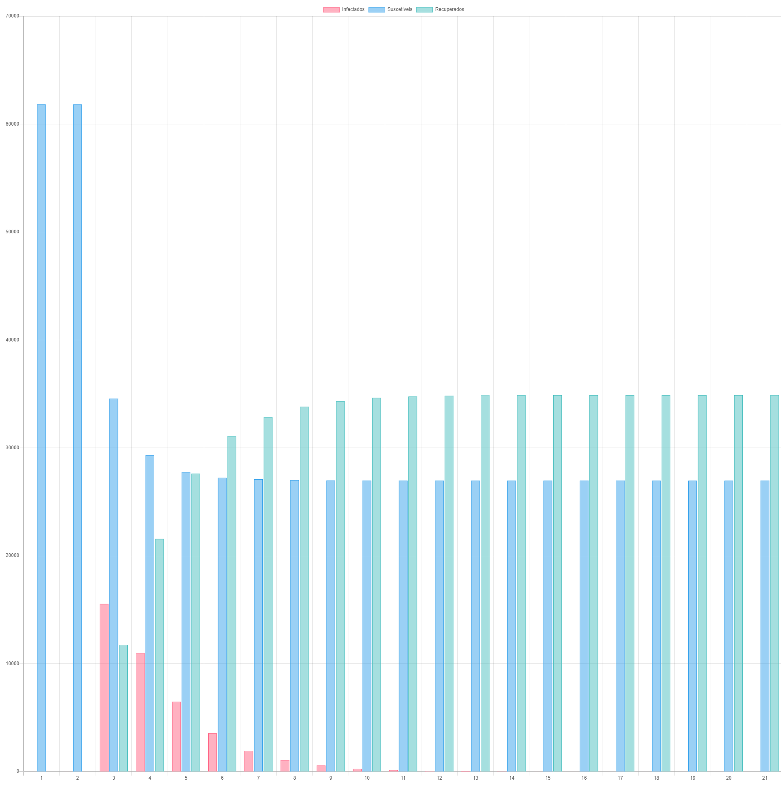
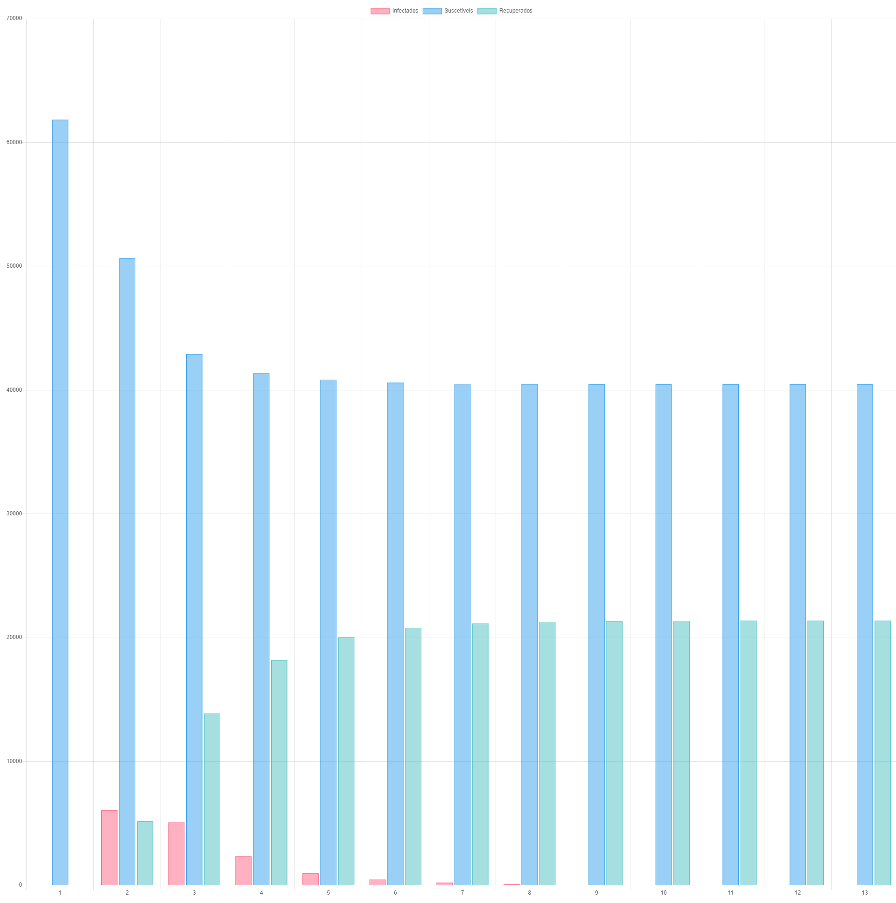
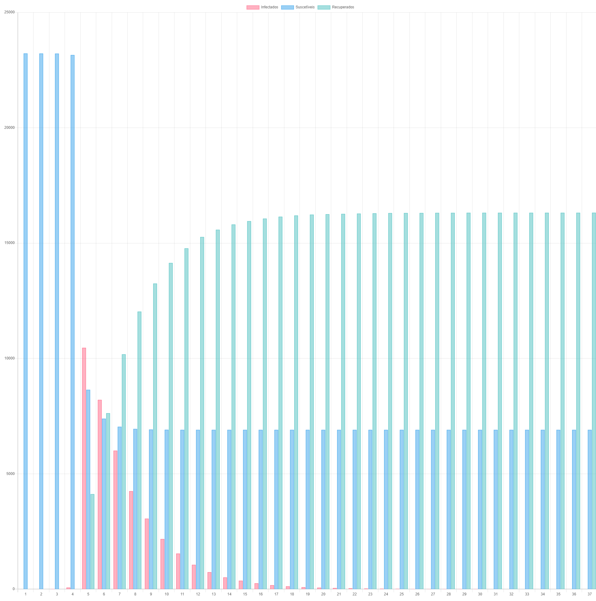
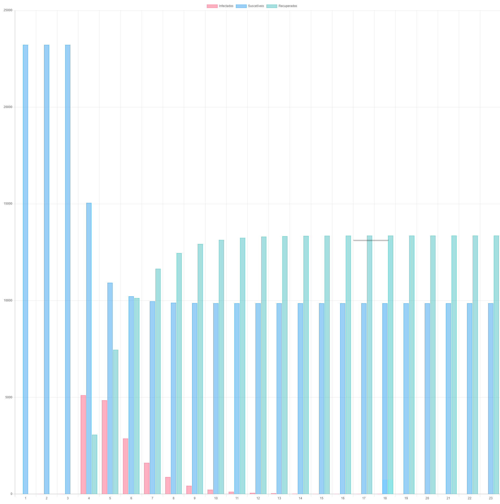
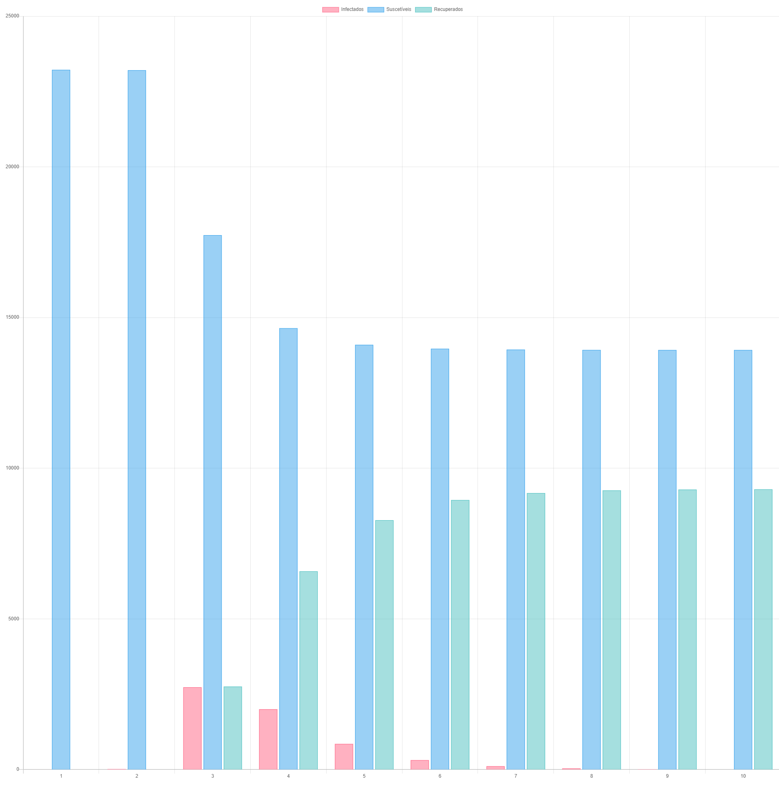
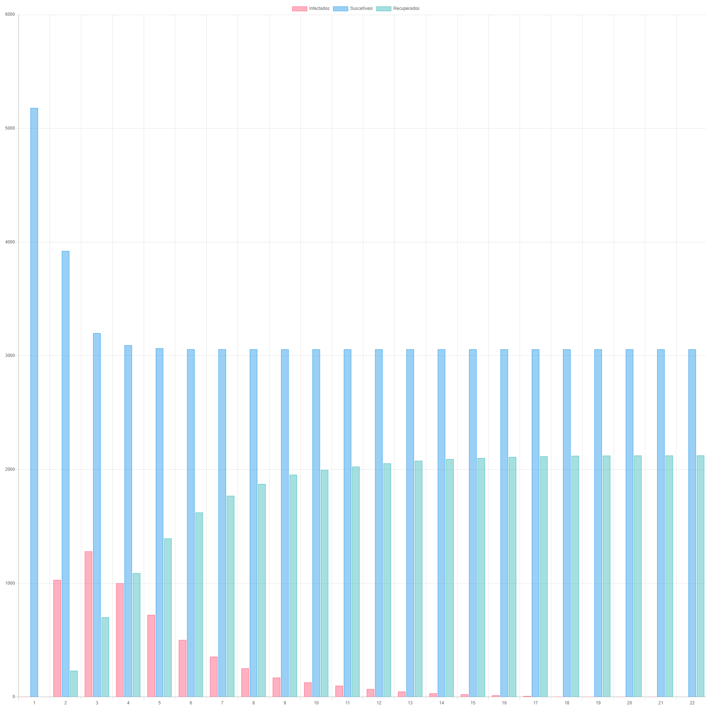
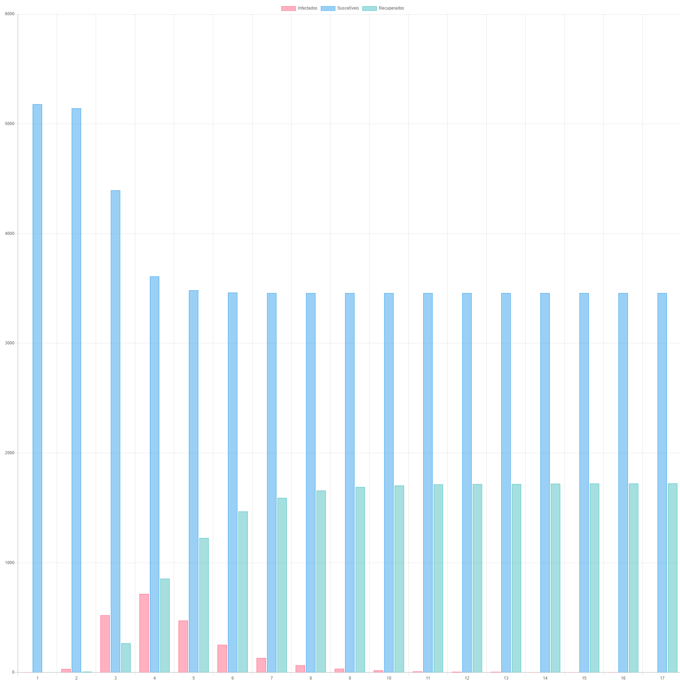
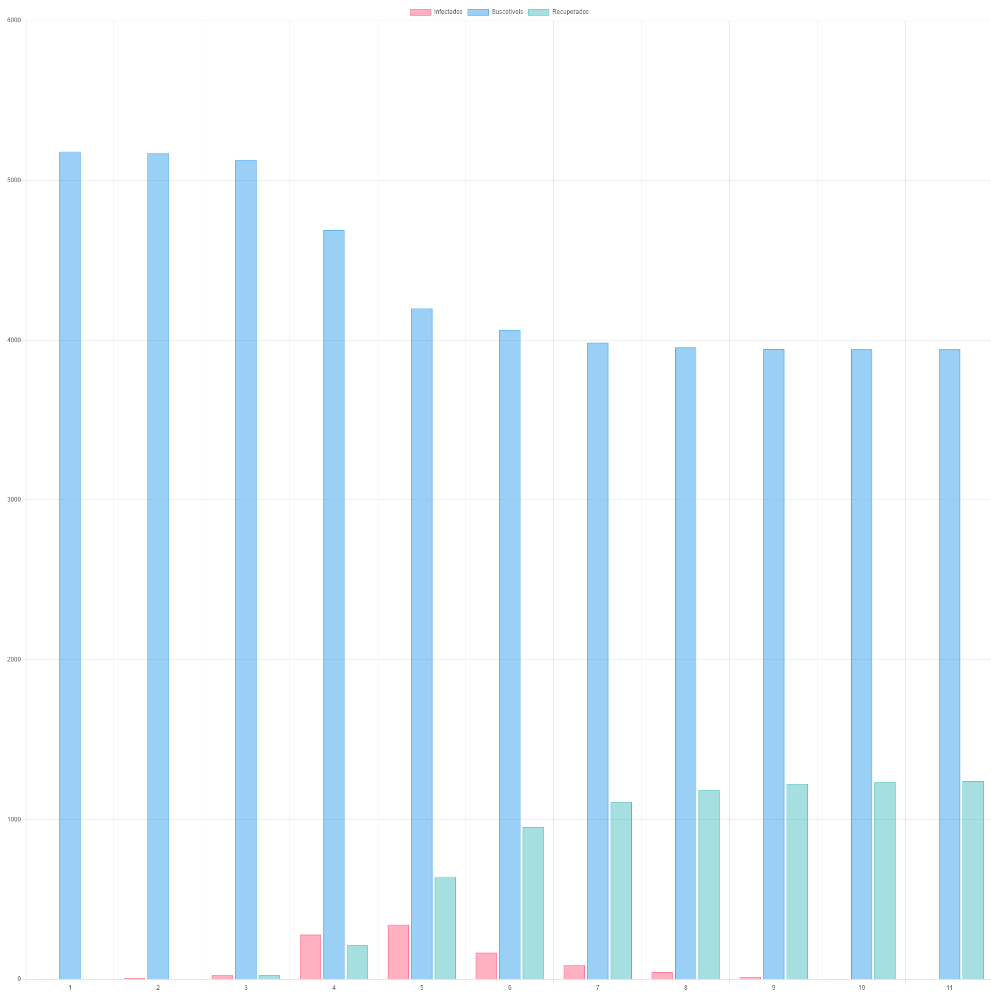

# O algoritmo

Para realizar a simulação, foi adicionada uma propriedade à classe **Node** chamada _SicknessType_. Essa propriedade é um _enum_ com os três tipos de _status_ disponíveis:

### Classe SicknessType.cs

```C#
public enum SicknessType
{
    Susceptible,
    Infected,
    Removed
}
```

### Classe Node.cs

```C#
public SicknessType SicknessType { get; set; }
```

Já na classe **Graph** foi criado o método _GetContagiousSimulation()_ que retorna uma lista de métricas. As métricas são uma classe que contém quatro propriedades: _Step_, que indica o tempo; _InfectedCount_, que indica a quantidade de infectados naquele tempo; _SusceptibleCount_, que indica a quantidade de pessoas suscetíveis à contaminação e _RemovedCount_, que indica a quantidade de pessoas que foram contaminadas mas já foram curadas.

### Classe ContagionSimulationMetrics.cs

```C#
public class ContagionSimulationMetrics
{
    public int Step { get; set; }
    public int InfectedCount { get; set; }
    public int SusceptibleCount { get; set; }
    public int RemovedCount { get; set; }
}
```

### Classe Graph.cs

```C#
public List<ContagionSimulationMetrics> GetContagiousSimulation(double contagiousProbability, double recoverProbability)
{
    // Marca todos os nós inicialmente como suscetíveis
    foreach (var node in Nodes)
    {
        node.SicknessType = SicknessType.Susceptible;
    }

    // Sorteia um nó aleatório e o marca como infectado
    var random = new Random();
    var randomNumber = random.Next(0, Nodes.Count());
    Nodes[randomNumber].SicknessType = SicknessType.Infected;

    // Inicia o contador de tempo (passos) em 1
    var steps = 1;

    // Adiciona o primeiro cenário, ou seja, aquele em que há somente um infectado inicial
    var simulationResult = new List<ContagionSimulationMetrics>
    {
        new ContagionSimulationMetrics
        {
            Step = steps,
            InfectedCount = Nodes.Count(n => n.SicknessType == SicknessType.Infected),
            SusceptibleCount = Nodes.Count(n => n.SicknessType == SicknessType.Susceptible),
            RemovedCount = Nodes.Count(n => n.SicknessType == SicknessType.Removed)
        }
    };

    // Executa enquanto houver pelo menos um infectado no grafo
    while (Nodes.Any(n => n.SicknessType == SicknessType.Infected))
    {
        steps++;

        // Percorre todos os nós infectados
        foreach (var node in Nodes.Where(n => n.SicknessType == SicknessType.Infected))
        {
            // Sorteia um número entre 0 e 1
            var x = random.NextDouble();

            // Se o número sorteado for menor que a probabilidade de recuperação, marca o nó como recuperado
            if (x <= recoverProbability)
            {
                node.SicknessType = SicknessType.Removed;
            }
            else // Do contrário, percorre todos os vizinhos
            {
                foreach (var neighboor in node.Neighboors.Where(n => n.SicknessType == SicknessType.Susceptible))
                {
                    // Sorteia um número entre 0 e 1
                    var y = random.NextDouble();

                    // Se o número sorteado for menor que a probabilidade de contágio, marca o nó como infectado
                    if (y <= contagiousProbability)
                    {
                        neighboor.SicknessType = SicknessType.Infected;
                    }
                }
            }
        }

        // Adiciona o cenário atual nas métricas
        simulationResult.Add(new ContagionSimulationMetrics
        {
            Step = steps,
            InfectedCount = Nodes.Count(n => n.SicknessType == SicknessType.Infected),
            SusceptibleCount = Nodes.Count(n => n.SicknessType == SicknessType.Susceptible),
            RemovedCount = Nodes.Count(n => n.SicknessType == SicknessType.Removed)
        });
    }

    // Retorna as métricas encontradas
    return simulationResult;
}
```

# Cenários utilizados

Foram utilizados os três cenários disponibilizados nessa simulação. Para cada cenário, os seguintes três pares de parâmetros foram utilizados:

| Probabilidade de Contágio | Probabilidade de Recuperação |
| ------------------------- | ---------------------------- |
| 70%                       | 30%                          |
| 50%                       | 50%                          |
| 30%                       | 70%                          |

Com essas combinações, foram obtidos 9 gráficos diferentes

# Gráficos

### Cenário 1 - Tudo aberto

#### Contágio 70% Recuperação 30%



Este primeiro cenário é aquele em que todos os lugares estão abertos, ou seja, não há nenhuma política de quarentena. Percebe-se que há um pico de contaminação logo no começo: na terceira iteração, há quase 30.000 infectados, número que representa quase metade da população. A partir de então o número de infectados vai diminuindo e o de removidos vai crescento. A pandemia leva 30 iterações para ser controlada.

O total de pessoas que foram infectadas após a simulação foi de aproximadamente 45.000 pessoas (indicado pelo número de removidos).

#### Contágio 50% Recuperação 50%



Neste cenário o pico continua iniciando logo no começo (a partir da 3a iteração), mas o número de infectados diminui consideravelmente, além de que a simulação acaba antes: na iteração número 21.

O pico desse cenário fica um pouco acima de 15.000 pessoas infectadas. O total de pessoas infectadas no final fica em torno de 35.000 pessoas.

#### Contágio 30% Recuperação 70%



Com uma probabilidade de contágio baixa e uma probabilidade de contágio alta temos uma redução drástica na taxa de infectados. O pico fica pouco acima de 5.000 e a pandemia dura apenas 13 iterações. O total de pessoas que foram contaminadas durante a simulação fica pouca coisa acima de 20.000.

### Cenário 2 - Locais de aglomerações fechados

Este cenário mostrou-se muito parecido com o cenário 1, sob as mesmas condições. Tanto o número do pico, a duração das iterações e o número final de pessoas que foram contaminadas ao longo das iterações ficaram bem parecidos com os números do primeiro cenário.

Isso mostra que uma quarentena parcial, a exemplo do que está acontecendo em algumas regiões do Brasil, talvez não tenha tanto efeito assim.

#### Contágio 70% Recuperação 30%



#### Contágio 50% Recuperação 50%



#### Contágio 50% Recuperação 50%



### Cenário 3 - Apenas serviços essenciais abertos

Se o Cenário 2 ficou parecido com o Cenário 1, a situação no Cenário 3 é bem diferente. Enquanto nos dois primeiros cenários o número de infectados foi bem alto logo no começo, neste cenário ele afetou poucas pessoas, até menos no par de probabilidades em que a probabilidade de contágio é alta (70%) e a de recuperação é baixa (30%).

Além disso, a pandemia levou menos tempo para ser controlada e o total de pessoas que foram contaminadas ao longo das iterações representou cerca de 30% da população (dependendo das probabilidades, menos que isso), enquanto nos outros dois cenário anteriores esse número representou cerca de 50% da população.

#### Contágio 70% Recuperação 30%



Enquanto o pico inicial afetou quase metade da população nos outros cenários, aqui afetou cerca de 1/6 dela.

#### Contágio 50% Recuperação 50%



#### Contágio 50% Recuperação 50%



# Conclusão

Ao longo dessas 5 tarefas foi possível utilizar uma pesquisa real, encomendada pelo Metrô de São Paulo, para realizar uma simulação de um caso também real que é a pandemia do Covid-19. Tudo isso graças às maneiras de representação de dados e técnicas para estudá-los, especificamente à Teoria dos Grafos que foi a representação utilizada nesse experimento.

O resultado obtido nesta última tarefa mostrou que um cenário em que não há política nenhuma de quarentena pode ser devastador para a população. Ao contrário do que se imagina, uma quarentena parcial não parece ter o efeito desejado, o estrago é tão grande quanto.

Somente com uma política de quarentena bem formada, em que apenas os serviços essenciais ficam abertos, é que começamos a ter um resultado positivo na luta contra a pandemia. Além do mais, essa política tem que ser aplicada o quanto antes, no momento em que o número de contaminações ainda é baixo.

Infelizmente temos visto em nosso país ações que vão contra a esse resultado, o que pode ser muito prejudicial para a população.
